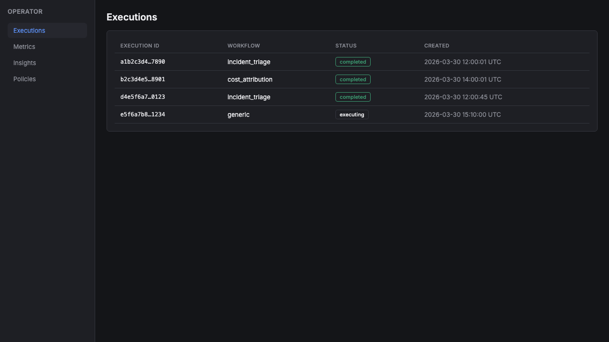
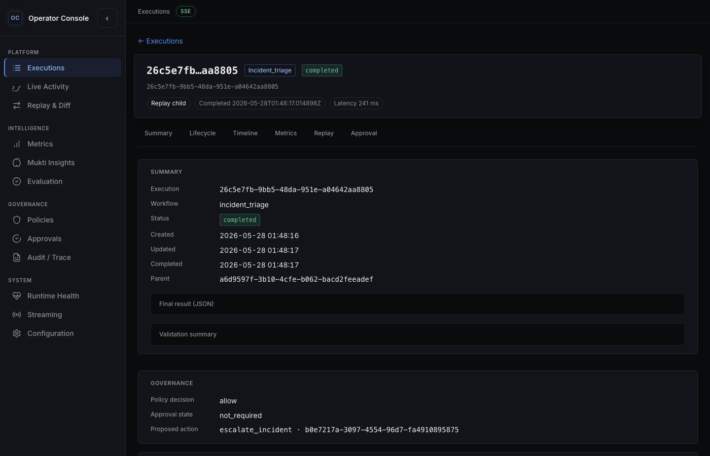
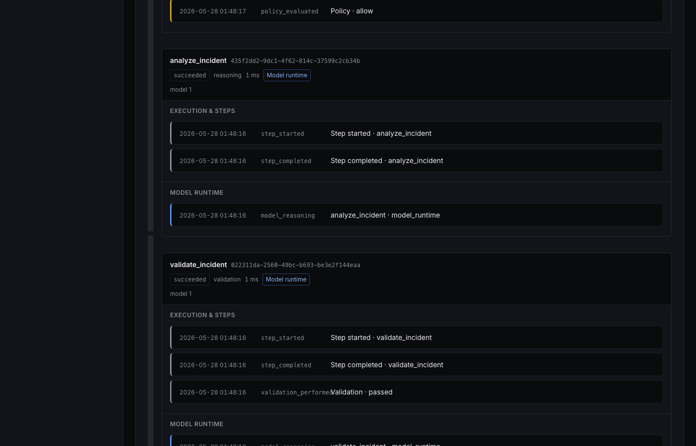
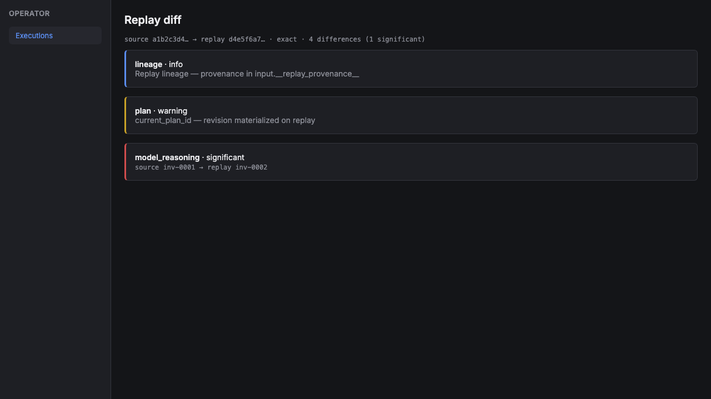
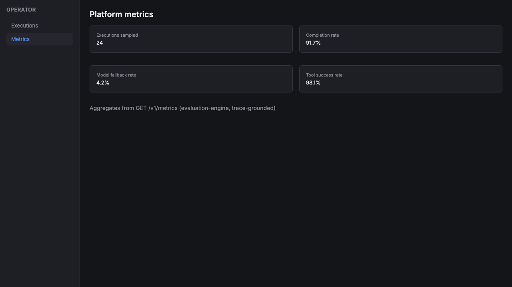
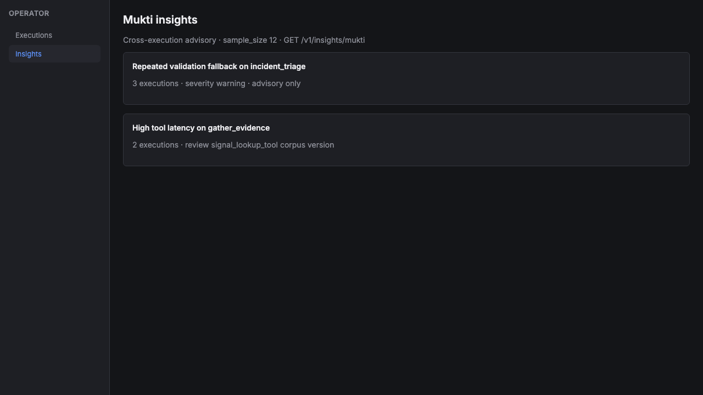
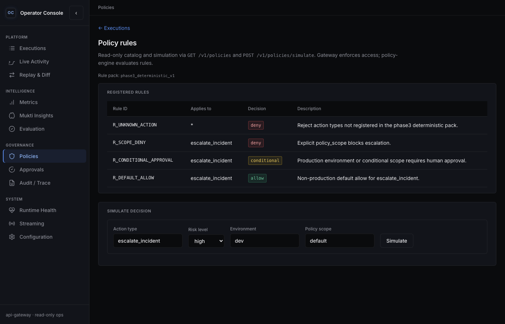
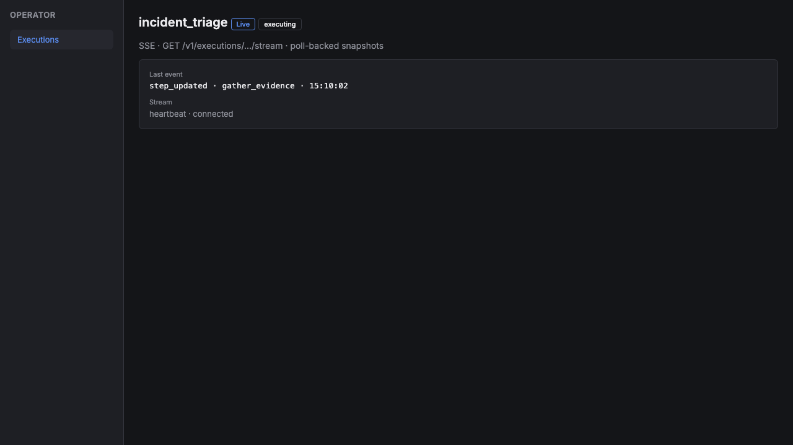

# Agentic AI Platform

Most workflow demos work until retries, approvals, policy denials, or partial failures need to be handled consistently. This repository treats those concerns as first-class runtime semantics—not as ad hoc prompt logic or hidden framework control flow.

A governed execution control plane for multi-step workflows over models, registered tools, and retrieval—with explicit lifecycle, policy gates, validation, and full traceability. Built as an internal platform (not a chatbot or framework demo): durable executions, auditable policy and tool records, operator UI over a single HTTP ingress, and service boundaries you can extend without forking the execution model.

---

## What this is / is not

| This is | This is not |
|---------|-------------|
| Step-based orchestration with deterministic state transitions | A prompt wrapper or conversational shell |
| Policy-engine + tool-runtime separation from agent logic | Uncontrolled “god agent” side effects |
| Post-execution Mukti analysis (advisory only; see below) | Runtime self-modification from insights |
| Angular operator-console over api-gateway only | UI-owned execution semantics |
| Local Docker demo with fake model provider (reproducible) | Claimed production Kubernetes / multi-region HA |

Governance reference: [project constitution](docs/overview/project-constitution.md) · [end state](docs/overview/project-end-state.md).

---

## Why not LangChain / LangGraph as the execution engine?

LangChain and LangGraph are useful for composing prompts, tools, and graphs quickly. This project deliberately does not delegate execution semantics to them.

- Platform vs framework orchestration — lifecycle, validation gates, and terminal outcomes live in the orchestrator and documented contracts, not in chain or graph wiring.
- Deterministic control layer — state transitions and retries are explicit and testable; models propose step outputs but do not own execution state.
- Replayability — a source execution can be replayed as a child run with server-computed diff; that requires durable execution records, not only in-memory graph state.
- Explicit execution state — plans, steps, policy evaluations, and tool calls are persisted and queryable via `/v1`, not inferred from framework callbacks alone.
- Policy separation — allow/deny/conditional decisions are evaluated by policy-engine before side effects; agents do not execute tools directly.
- Traceability — timelines are built from stored artifacts (model, tool, policy, validation events), suitable for operator investigation and audit.
- No hidden control flow in prompts — critical behavior must not exist only inside prompt templates or implicit graph branches ([constitution §2](docs/overview/project-constitution.md)).

Frameworks can still be used at the edges (e.g. inside a bounded agent step) where appropriate; they are not the system of record for execution.

---

## Screenshots

Modern operator console (local stack): sidebar with SVG icons, execution explorer with filters, grouped trace timeline, replay diff UX, Mukti insights cards, policy simulation, and live activity rail. Layout follows [ui-system](docs/design/ui-system.md).

Regenerate after UI changes (stack up and seeded):

```bash
make docker-up && make docker-seed
pip install playwright && playwright install chromium
CAPTURE_LIVE=1 CONSOLE_URL=http://localhost:4200 make capture-screenshots
```

Offline fallback (HTML fixtures): `make capture-screenshots`.

| Execution Explorer | Execution Detail | Trace Timeline |
|:---:|:---:|:---:|
| [](docs/assets/screenshots/01-execution-explorer.png) | [](docs/assets/screenshots/02-execution-detail.png) | [](docs/assets/screenshots/03-trace-timeline.png) |

| Replay Diff | Metrics | Mukti Insights |
|:---:|:---:|:---:|
| [](docs/assets/screenshots/04-replay-comparison.png) | [](docs/assets/screenshots/05-metrics-evaluation.png) | [](docs/assets/screenshots/06-mukti-insights.png) |

| Policy Simulation | Live Activity | Workflows |
|:---:|:---:|:---:|
| [](docs/assets/screenshots/07-policy-simulation.png) | [](docs/assets/screenshots/08-streaming-execution.png) | [Cost Attribution](docs/assets/screenshots/09-cost-attribution-workflow.png) · [Incident Triage](docs/assets/screenshots/10-incident-triage-workflow.png) |

Full index: [docs/assets/screenshots/](docs/assets/screenshots/).

---

## What is implemented

Phases 1–8 are represented for local demo depth: execution core, incident triage and cost attribution workflows, governance (policy + approvals), tools and knowledge, model-runtime (default `MODEL_PROVIDER=fake`), feedback + Mukti, evaluation metrics, api-gateway (HTTP + SSE), operator-console.

The Mukti agent (named after the Sanskrit term for release/liberation) performs post-execution advisory analysis over stored traces and feedback. It does not modify running executions or policy rules.

| Area | Status |
|------|--------|
| Orchestrator (plans, steps, validation, replay) | Implemented |
| Policy-engine | Implemented |
| Tool-runtime | Implemented |
| Knowledge-service | Implemented |
| Model-runtime (`MODEL_PROVIDER=fake` default) | Implemented |
| Feedback-service | Implemented |
| Mukti-agent (post-execution advisory) | Implemented |
| Evaluation-engine (aggregates / replay diff) | Implemented |
| API gateway (ingress, RBAC, SSE) | Implemented |
| Operator-console (grouped trace, replay diff, live activity) | Implemented |
| Local Docker stack (Postgres + gateway + console) | Implemented |

Repository layout vs local runtime: the repo contains 10 logical Python services under `services/`. The recommended local demo runs 3 long-running Docker containers—`postgres`, `api-gateway`, `operator-console`—with platform runtimes wired in-process inside the gateway image for operational simplicity. Boundaries remain in code and contracts; this is not a monolith rewrite.

---

## Architecture overview


Console and external clients call api-gateway only. The gateway forwards to orchestrator, which coordinates policy-engine, tool-runtime, knowledge-service, and model-runtime. Feedback, Mukti, and evaluation consume completed work; Postgres backs persistence in the default compose stack.

Deeper narrative: [system overview](docs/architecture/system-overview.md) · [runtime model](docs/architecture/runtime-model.md) · [API design](docs/architecture/api-design.md).

<details>
<summary>Text diagram (fallback)</summary>

```text
operator-console  →  api-gateway  →  orchestrator
                          │              ├── policy-engine
                          │              ├── tool-runtime
                          │              ├── knowledge-service
                          │              ├── model-runtime
                          │              └── feedback / Mukti / evaluation
                          └── PostgreSQL (compose default)
```

</details>

| Diagram | Description |
|---------|-------------|
| [system-overview.svg](docs/diagrams/system-overview.svg) | Services, trust boundaries, console → gateway only |
| [execution-lifecycle.svg](docs/diagrams/execution-lifecycle.svg) | States, validation gate, terminal outcomes |
| [replay-architecture.svg](docs/diagrams/replay-architecture.svg) | Source execution, replay child, server diff |
| [mukti-analysis-flow.svg](docs/diagrams/mukti-analysis-flow.svg) | Traces → execution_feedback → advisory insights |
| [streaming-architecture.svg](docs/diagrams/streaming-architecture.svg) | SSE path to operator-console |
| [cost-attribution-workflow.svg](docs/diagrams/cost-attribution-workflow.svg) | Cost workflow steps and service calls |

Editable sources: `docs/diagrams/*.drawio` · index: [docs/diagrams/README.md](docs/diagrams/README.md).

---

## Demo walkthrough (what to click first)

After [quick start](#quick-start) and `make docker-seed`:

1. Executions — filter by workflow/status; open `incident_triage` or `cost_attribution` rows.
2. Execution detail — ribbon summary, lifecycle steps, governance snippet.
3. Trace timeline (detail, scroll to timeline) — grouped model / tool / policy / error events.
4. Replay & Diff (sidebar) or detail replay panel → replay diff (server-computed categories).
5. Metrics — platform rollups; Evaluation route for per-run views where exposed.
6. Mukti Insights — cross-execution advisory cards (`make docker-seed` with `sample_size > 0`).
7. Policies — rule catalog and simulate (admin role in dev headers).
8. Live Activity — non-terminal runs; active executions show SSE on detail when running.

Guided write-ups: [incident triage](docs/workflows/incident-triage-walkthrough.md) · [cost attribution](docs/workflows/cost-attribution-walkthrough.md) · [replay investigation](docs/workflows/replay-investigation-walkthrough.md).

Example artifacts: [incident trace](docs/examples/incident-trace.json) · [cost trace](docs/examples/cost-attribution-trace.json) · [replay diff sample](docs/examples/replay-diff-example.json).

---

## Quick start

```bash
cp .env.example .env
make docker-up          # postgres, migrate, build api-gateway + operator-console
make docker-seed        # incident + cost executions, replay, feedback, Mukti rows
```

| Endpoint | URL |
|----------|-----|
| Operator console | http://localhost:4200 |
| API gateway | http://localhost:8080 |
| Runtime health | http://localhost:8080/health/runtime |
| Prometheus metrics | http://localhost:8080/metrics |

No external LLM API keys when `MODEL_PROVIDER=fake` (compose default). Details: [local development runbook](docs/runbooks/local-development.md).

Troubleshooting:

- First `make docker-up` can take several minutes (gateway image + `npm install` / `ng build` for console).
- If Mukti insights show zero sample size, ensure seed completed against Postgres (`make docker-seed` logs `mukti insights sample_size > 0`); compose forces `GATEWAY_USE_POSTGRES=true`—host `.env` `GATEWAY_USE_POSTGRES=false` does not apply inside containers.
- If seed or health fails: `make smoke-stack`, then `docker compose logs api-gateway` / `postgres`.
- UI changes in Docker require rebuild: `docker compose build operator-console && docker compose up -d --force-recreate operator-console`.

Host alternative: `make setup`, `docker compose up -d postgres`, `make migrate`, then `make run-gateway` + `make run-console` in separate terminals.

```bash
make test             # gateway + orchestrator unit tests
make smoke-stack      # health + /v1/metrics + executions (stack must be up)
```

---

## Repository map

| Path | Purpose |
|------|---------|
| `docs/` | Constitution, architecture, workflows, runbooks, diagrams — [docs index](docs/README.md) |
| `packages/common-schemas/` | Shared Pydantic contracts |
| `services/orchestrator/` | Execution engine, planners, persistence |
| `services/policy-engine/` | Allow / deny / conditional evaluation |
| `services/tool-runtime/` | Registered tools |
| `services/knowledge-service/` | Retrieval for evidence steps |
| `services/model-runtime/` | Structured model client (fake default) |
| `services/feedback-service/` | Operator + Mukti persistence |
| `services/mukti-agent/` | Post-execution analysis |
| `services/evaluation-engine/` | Metrics and replay-diff projections |
| `services/api-gateway/` | HTTP ingress, RBAC, SSE |
| `services/operator-console/` | Angular operator UI |
| `infra/db/migrations/` | PostgreSQL DDL |
| `scripts/` | Migrations, `seed_demo_data.py`, screenshot capture |
| `docker/` | Dockerfiles; `docker-compose.yml` local stack |

---

## Key design documents

| Document | Why read it |
|----------|-------------|
| [Constitution](docs/overview/project-constitution.md) | Non-negotiable platform rules |
| [End state & phases](docs/overview/project-end-state.md) | Scope and maturity targets |
| [System overview](docs/architecture/system-overview.md) | Service ownership |
| [Runtime model](docs/architecture/runtime-model.md) | Execution semantics |
| [API design](docs/architecture/api-design.md) | `/v1` surface |
| [Security & guardrails](docs/architecture/security-and-guardrails.md) | RBAC and roles |
| [UI system](docs/design/ui-system.md) | Operator-console design discipline |

---

## Current limitations (intentional for local demo)

- Not a production deployment: no Kubernetes manifests, multi-region HA, or cloud IaC in this repo.
- Default model provider is fake — reproducible structured outputs without vendor API keys.
- Execution worker queue is in-process in local gateway configuration (not a separate broker service).
- Prometheus `/metrics` reflect the gateway process; not a full observability stack.
- Auth uses dev header fallback (`GATEWAY_ALLOW_DEV_PRINCIPAL_FALLBACK`); not full enterprise OIDC.
- Service boundaries are logical in code; local demo colocates runtimes in the api-gateway container—a demo tradeoff, not a requirement that production be single-process.

Orchestrator-only path (no HTTP): see [local development](docs/runbooks/local-development.md#orchestrator-only-demo-no-http).

---

## Design takeaways

- Control plane thinking: execution state, policy, and tools are separate; models do not own transitions.
- Inspectable operations: trace timeline, replay diff, and metrics are derived from stored artifacts—not client-invented KPIs.
- Product surface discipline: gateway + console are thin; contracts live in `common-schemas` and documented APIs.
- End-to-end demo: two workflows, seed script, Docker stack, and UI screenshots you can verify locally in under an hour.

---

## Documentation index

Compact map of `docs/`: [docs/README.md](docs/README.md).
