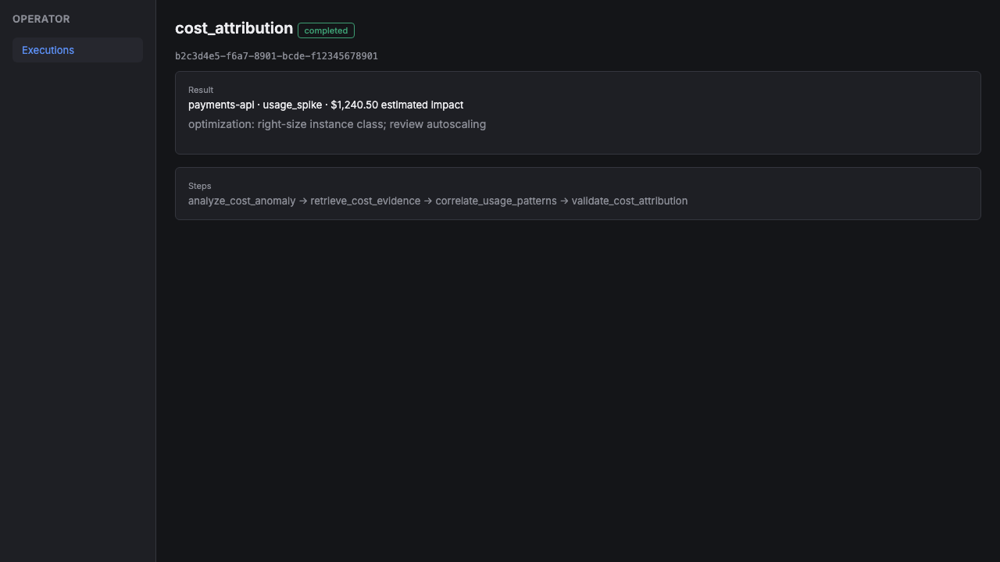

# Cost attribution — engineering walkthrough

One-line purpose: trace-grounded cost investigation without incident escalation governance.

## Workflow goal

Explain cost anomalies for a scope/service using structured model steps, billing/cost corpus retrieval, usage correlation tools, and a validation gate. Optimization suggestions are **advisory strings** in the result—no autonomous remediation.

## Execution stages

| Step | Service(s) | Trace signals |
|------|--------------|---------------|
| `analyze_cost_anomaly` | orchestrator, model-runtime | `model_reasoning`, `step_completed` |
| `retrieve_cost_evidence` | orchestrator, knowledge-service | `knowledge_retrieved` |
| `correlate_usage_patterns` | orchestrator, tool-runtime | `tool_call_completed` (cloud_cost_tool, metrics_lookup_tool) |
| `validate_cost_attribution` | orchestrator, model-runtime | `validation_performed` |
| Terminal | orchestrator | `execution_status: completed` (no `policy_evaluated` on this path) |

## Services involved

Same platform boundaries as incident triage; **policy-engine** is not invoked for completion on this workflow today.

## Trace behavior

See [cost-attribution-trace.json](../examples/cost-attribution-trace.json) for a bounded timeline. Seeded demo: `make docker-seed` creates `cost_attribution` with idempotency key `demo-seed-cost-v1`.

## Policy behavior

No `escalate_incident` proposal on the cost path. Tool calls use read-only/idempotent stand-ins per tool contracts.

## Evidence flow

1. **Analyze** — structured `CostAttributionReasoningOutput` (suspected service, anomaly type, impact estimate).
2. **Retrieve** — playbook/corpus chunks referenced in step evidence.
3. **Correlate** — tool outputs joined into step result.
4. **Validate** — `CostValidationOutput` and `validation_status` before `COMPLETED`.

## Metrics and insights

- Per-execution: `GET /v1/executions/{id}/metrics` (evaluation-engine aggregates).
- Platform: `GET /v1/metrics`.
- Post-run Mukti: `GET /v1/insights/mukti` after operator feedback (seed script records samples).

## Replay and debugging

Replay preserves workflow type and step names; diff highlights plan ids and model invocation metadata when outputs differ ([replay-diff-example.json](../examples/replay-diff-example.json)).

## Related docs

- [cost-attribution.md](cost-attribution.md)
- [cost-attribution-workflow diagram](../diagrams/cost-attribution-workflow.svg)
