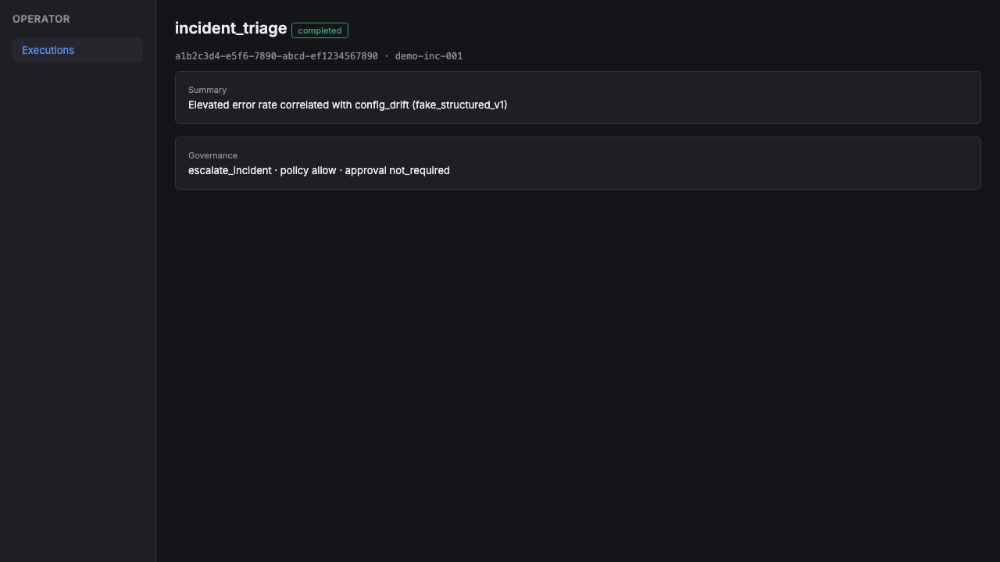

# Incident triage — engineering walkthrough

One-line purpose: operator-oriented path through a completed **`incident_triage`** run using seeded demo data and persisted trace semantics.

## Workflow goal

Structured investigation of an incident: model-backed analysis, retrieval and tools for evidence, validation, then **policy-gated** escalation proposal. Outcomes are **recorded** (timeline, tool calls, policy evaluation)—not live ticket mutations.

## Execution stages

| Stage | Status | What happens |
|-------|--------|----------------|
| Create | `created` | Gateway `POST /v1/executions` → orchestrator persists context + execution. |
| Plan | `planning` | Planner emits `analyze_incident` → `gather_evidence` → `validate_incident`. |
| Run steps | `executing` | Model-runtime (or deterministic fallback) on analyze/validate; knowledge + tools on gather. |
| Validate gate | `validating` | All non-validation steps succeeded; validation step runs. |
| Govern | `validating` → terminal | `escalate_incident` proposal → **policy-engine** → allow / deny / conditional. |
| Complete | `completed` | Default dev scope: **allow** without approval (see [policy-aware-execution.md](policy-aware-execution.md)). |

## Services involved

- **api-gateway** — ingress, RBAC, SSE stream (observational).
- **orchestrator** — lifecycle, planner, step execution, governance segment.
- **model-runtime** — `analyze_incident`, `validate_incident` (fake provider in local stack).
- **knowledge-service** — retrieval during `gather_evidence`.
- **tool-runtime** — `incident_metadata_tool`, `signal_lookup_tool`.
- **policy-engine** — `evaluate_proposal` on escalation only.

## Trace behavior

Timeline events include `execution_status`, `step_started` / `step_completed`, `model_reasoning`, `knowledge_retrieved`, `tool_call_completed`, `validation_performed`, `action_proposed`, `policy_evaluated`, `governed_outcome`.

Example artifact: [incident-trace.json](../examples/incident-trace.json).

Console: open execution **`a1b2c3d4-e5f6-7890-abcd-ef1234567890`** (fixture ID) or a seeded run from `make docker-seed`.

## Policy behavior

- `policy_scope: default`, `environment: dev` → **allow** escalation.
- `phase3_deny` → **deny**, execution **failed** with `governed_outcome` / `policy_denied`.
- `prod` or `phase3_conditional` → **awaiting_approval** until `POST …/approvals`.

## Evidence and tools

`gather_evidence` merges knowledge chunks and tool outputs into `step_result.evidence`. Tool calls are auditable rows and `tool_call_completed` timeline entries.

## Validation

`validate_incident` produces `validation_performed` and `validation_status` in the result. Completion requires validation success before governance.

## Replay and debugging

- **Exact replay:** `POST /v1/executions/{id}/replay` with `mode: exact`.
- **Diff:** `GET /v1/executions/{source}/replay-diff/{replay}` — see [replay-investigation-walkthrough.md](replay-investigation-walkthrough.md).
- **Stream:** `GET /v1/executions/{id}/stream` for live status while a run is in progress.

## Related docs

- [incident-triage.md](incident-triage.md) — step table
- [replaying-executions.md](../runbooks/replaying-executions.md)
- [local-development.md](../runbooks/local-development.md)
